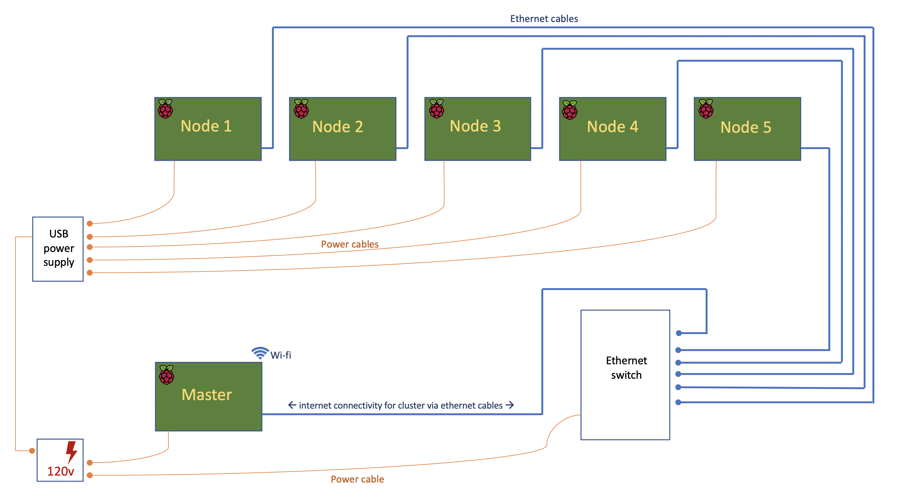

=================
Cluster Computing
=================

Overview
^^^^^^^^

This recipe documets the steps taken in setting-up a cluster of Raspberry Pis.  The idea is to try a few different approaches and in doing so reinforce understanding of some of the principles relating to linux networking, distributed computing and a few other things...

-----

Architecture/Framework
^^^^^^^^^^^^^^^^^^^^^^
The architecture for this first cluster will comprise of 5 Raspberry Pi 3 Model B+ worker nodes, powered by a USB power supply unit and networked together via a simple unmanaged switch. The master node will be a Raspberry Pi 4 (4gb RAM) on a separate power-supply wired into the same network switch.

The master node will connect to the internet via wireless LAN and using "IP Masquerading" will provide gateway access to the internet for the worker nodes only when needed.

Operating system on master and worker nodes will be Raspbian/Debian flavour of linux.

-----

**Schematic**

-----

**Parts List**

+----------+-------------------------------------------------------------+-----------+---------+
| Quantity |              Part                                           | Source    |   Cost  |
+==========+=============================================================+===========+=========+
|    1     | Raspberry Pi 4 (4gb)                                        | Canakit   |  $  55  |
+----------+-------------------------------------------------------------+-----------+---------+
|    5     | Raspberry Pi 3 Model B+                                     | Canaki    |  $ 175  |
+----------+-------------------------------------------------------------+-----------+---------+
|    5     | Cat5e 1ft Ethernet patch cable                              | Amazon    |  $   8  |
+----------+-------------------------------------------------------------+-----------+---------+
|    1     | Cat6 18in Ethernet patch cable                              | Amazon    |  $   5  |
+----------+-------------------------------------------------------------+-----------+---------+
|    1     | GeauxRobot 6 layer dog bone stack                           | Amazon    |  $  32  |
+----------+-------------------------------------------------------------+-----------+---------+
|    1     | Clear Case for Raspberry Pi 4                               | Amazon    |  $   5  |
+----------+-------------------------------------------------------------+-----------+---------+
|    1     | Anker 60W PowerPort 6-port wall charger (2.4A per port max) | Amazon    |  $  30  |
+----------+-------------------------------------------------------------+-----------+---------+
|    6     | Sabrent 22AWG 1ft micro USB to USB cables                   | Amazon    |  $   8  |
+----------+-------------------------------------------------------------+-----------+---------+
|    1     | 15W (5v, 3A) power supply (Raspi 4)                         | Pi Shop   |  $   8  |
+----------+-------------------------------------------------------------+-----------+---------+
|    1     | NETGEAR 8-Port Gigabit Ethernet Unmanaged Switch            | Amazon    |  $  22  |
+----------+-------------------------------------------------------------+-----------+---------+
|    1     | Powerstrip with independent switches                        | Amazon    |  $  20  |
+----------+-------------------------------------------------------------+-----------+---------+
|    6     | SanDisk 32GB MicroSD HC ultra 80mb/s (non A1)               | Amazon    |  $  36  |
+----------+-------------------------------------------------------------+-----------+---------+
|          |                                                             |           |  $ 404  |
+----------+-------------------------------------------------------------+-----------+---------+

-----

Set-up of Master Node
^^^^^^^^^^^^^^^^^^^^^^

**Install and configure operating system**

(1) See: https://raspi-recipes.readthedocs.io/en/latest/initialSetup.html#

(2) Install python (in case not already installed), along with the `fabric package <http://www.fabfile.org/>`_ that will be needed later.

    .. code-block:: bash

        sudo apt install python3-pip

        sudo pip3 install fabric

------

**Configure Master Node as conduit for internet access for cluster**

The Master Node will be the sole device on the cluster that connects to the internet. When worker nodes require internet access then they will connect via the Master Node (if allowed). The set-up here is based on what was learned when configuring another Raspberry Pi to provide service as a secondary `access point <https://raspi-recipes.readthedocs.io/en/latest/networking.html#create-wireless-access-point>`_ .

