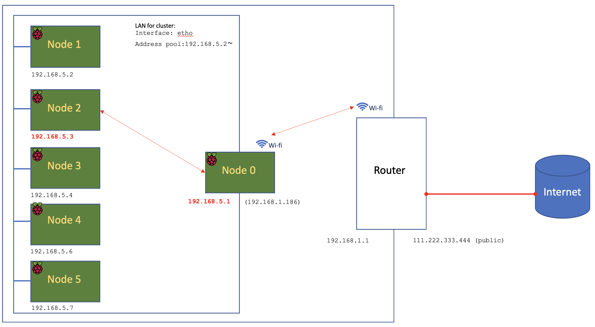
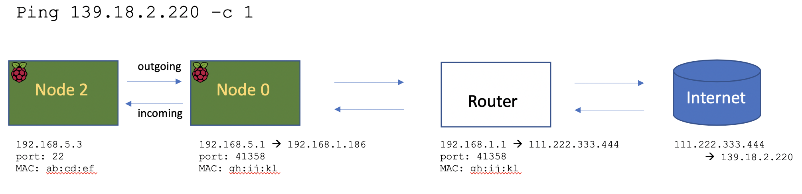

=====================
Set-up of Master Node
=====================

This is the Raspberry pi which will control and manage the set of worker nodes.  

Install and configure operating system
--------------------------------------

(1) See: https://raspi-recipes.readthedocs.io/en/latest/initialSetup.html

(2) Install python (in case not already installed), along with the `fabric package <http://www.fabfile.org/>`_ that will be needed later.

.. code-block:: bash

        sudo apt install python3-pip

        sudo pip3 install fabric
        
(3) Install other tools that we'll need

.. code-block:: bash
        sudo apt install tcpdump
        sudo apt install nmap
        sudo apt install sshpass

------

Configure internet access for cluster
-------------------------------------

The Master Node will be the sole device on the cluster that connects to the internet. When worker nodes require internet access they will connect via the Master Node (if/when allowed). The set-up here is based on what was learned when configuring another Raspberry Pi to provide service as a secondary `access point <https://raspi-recipes.readthedocs.io/en/latest/accessPoint.html>`_ .

**(1) Install linux command line utility dnsmasq and then stop the service before making configuration changes**

.. code-block:: bash

        sudo apt-get install dnsmasq

        sudo systemctl stop dnsmasq
        
*ref: https://en.wikipedia.org/wiki/Dnsmasq*

**(2) Edit the DHCP client daemon configuration file**

.. code-block:: bash

            sudo nano /etc/dhcpcd.conf
            
...adding the following lines at the bottom in order to assign a static IP address to the master node:

.. code-block:: bash

        interface eth0
        static ip_address=192.168.5.1/24 
        
Save, exit, and then restart the service:

.. code-block:: bash

        sudo service dhcpcd restart
        

**(3) Control assignment of IP addresses to the worker nodes:**

.. code-block:: bash

        sudo nano /etc/dnsmasq.conf
        
After making sure that *every* line is commented out (usually the case, but there might be two at the bottom) add the following lines:

.. code-block:: bash

        interface=eth0 # internet service to the nodes via ethernet 
        dhcp-range=192.168.5.2,192.168.5.64,255.255.255.0,24h # range of IP addresses
    
save, exit and then restart the service:

.. code-block:: bash

        sudo systemctl start dnsmasq
        
**(4) Enable IP forwarding:**

.. code-block:: bash

        sudo nano /etc/sysctl.conf
    
uncomment/enable this line:

.. code-block:: bash
        net.ipv4.ip_forward=1
        
**(5) Now, iptables needs to be configured for ip packet filter rules**

This is needed in order to allow all worker nodes to use the IP address of the master node when connecting to the internet. This is known as *masquerading* and the firewall keeps track of the incoming and outgoing connections (ie how to directly traffic to/from the relevant node) using Network Address Translation (NAT). Essentially by keeping track of ports and MAC addresses.

.. code-block:: bash

        sudo iptables -t nat -A  POSTROUTING -o wlan0 -j MASQUERADE
        
and then save the rules so they are not lost upon reboot:

.. code-block:: bash

        sudo sh -c "iptables-save > /etc/iptables.ipv4.nat"

Then edit this file so that rules are installed upon boot:

.. code-block:: bash

        sudo nano /etc/rc.local
    
and add the following line just above the "exit 0":

.. code-block:: bash

        iptables-restore < /etc/iptables.ipv4.nat
    
Now reboot the master node.   To list the rules in iptables:

.. code-block:: bash

        sudo iptables -t nat -L
    
-----

Overview
^^^^^^^^

The following diagram illustrates how *masuerading* and network address translation will work once all nodes are set-up:

The way it works is as follows:

(1) When the worker nodes 1-5 come on line they will request an IP address from the `DHCP <https://en.wikipedia.org/wiki/Dynamic_Host_Configuration_Protocol#Discovery>`_ server running on the master node.  This will either be a new one, or the previously assigned one if available.  At this point the IP address for each node is mapped to its corresponding MAC address.

|br|

(2) If node 2 seeks to connect to the internet (eg via a ping request sent via TCP on port 22) then that will travel to the master node.  The master node using the DNS Masquerading will mask node2's IP address with it's own which will then travel to the router before itself betting masked with the router's public IP address.

At each step of the way mappings and tables are maintained so that when a response is received from the internet it knows how to find its way back to node2 which sits in an isolated part of the network.

-----

Node 2 can communicate outside of the cluster but nothing outside the isolated network can communicate in.

This can be seen in action using ``tcpdump``

    .. code-block:: bash

        sudo tcpdump -i eth0 -en
    

The master node is now ready.  It might make sense to `back-up <https://medium.com/@ccarnino/backup-raspberry-pi-sd-card-on-macos-the-2019-simple-way-to-clone-1517af972ca5>`_.

-----

