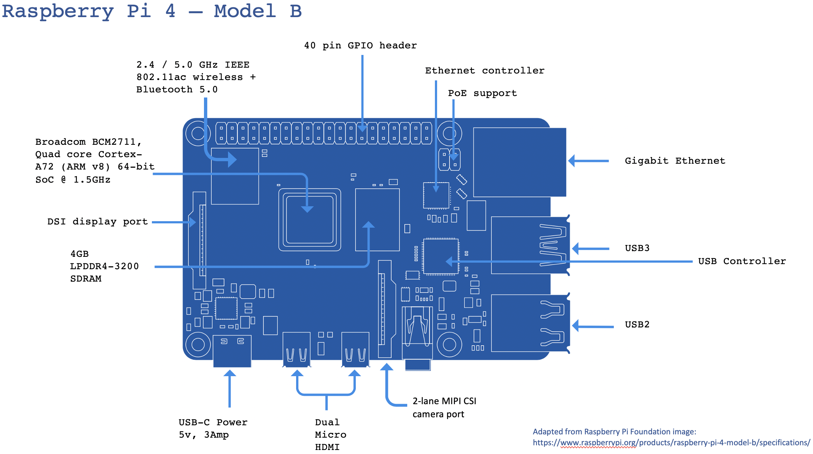

.. Raspberry Pi Recipes master file, created by
   sphinx-quickstart on Fri May 15 23:59:50 2020.
   You can adapt this file completely to your liking, but it should at least
   contain the root `toctree` directive.

a collection of recipes for the Raspberry Pi
============================================

|
|

.. toctree::
   :maxdepth: 3
   :hidden:

   intro
   initialSetup
   readthedocs

