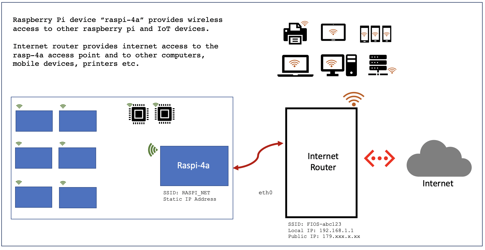

==========
Networking
==========

.. role:: bash(code)
   :language: bash

Create wireless access point
----------------------------

Background
^^^^^^^^^^
For the past few months I've had a Raspberry Pi 4 (raspi-4a) connected to my home network via ethernet cable and running 24/7. I can remote into the device using ssh from both within my local network and also from outside using port forwarding. 

There are also other Raspberry Pi boards that connect to the same router via wifi.  There are also computers, phones, iPads and other wireless devices that connect to the same wifi router.  While every device has its own MAC address and operates on an assigned channel there is still a chance of conflicts, latency, and other non-optimal behavior when not using a router not designed to handle that capacity.

.. image:: images/raspi4a_accesspoint.png
    :align: center
    :alt: raspi4a_as_accesspoint

-----

Objective
^^^^^^^^^

Reduce number of wifi devices connecting to the internet router by directing raspberry pi wireless traffic via the raspi-4a which is connected to the internet via ethernet. This raspi-4a device which acting as a wireless access point will broadcast its own SSID ("RAPI-NET").  The Raspi4a will still function normally as a raspberry pi while simultaneouly offering wireless access to any device with correct credentials. 

-----

Access Point set-up
^^^^^^^^^^^^^^^^^^^

This involves changes to various network configurations so it's a good idea to clone the SD Card so that there is a point to revert any changes back to.  Also, changes in network settings may result in lost SSH connection so use a monitor and keyboard to be on the safe side...

**(1) Check for updates**

.. code-block:: bash

    sudo apt-get update
    sudo apt-get upgrade
    
**(2) Install required packages**

.. code-block:: bash

    sudo apt-get install hostapd   # to create a wireless hotspot
    sudo apt-get install dnsmasq   # easy-to-use DHCP and DNS server
    sudo apt install bridge-utils  # to enable bridge between eth0 and wireless 
    
**(3) Switch off servces before changing any configurations:**

.. code-block:: bash

    sudo systemctl stop hostapd
    sudo systemctl stop dnsmasq
    
**(4) Edit the dhcpcd configuration file**

.. code-block:: bash

   sudo nano /etc/dhcpcd.conf 
   
and add:

.. code-block:: bash

    # These first 2 lines were added later after lots of trial and error... 
    # Both are needed to ensure that the bridge works correctly.
    # They stop the eth0 and wlan0 ports being allocated IP 
    # addresses by the DHCP client on the Raspberry Pi

    denyinterfaces wlan0    
    denyinterfaces eth0     

    # Next configure a static IP for the wlan0 interface

    interface wlan0
    static ip_address=192.168.4.1/24
    nohook wpa_supplicant

    # static IP address to enable ssh and also accessing 
    # the internet from the raspberry pi.
    # This bit was also discovered after some trial and error...

    interface br0
    static ip_address=192.168.1.184/24  # assigning to AP
    static routers=192.168.1.1
    static domain_name_servers=8.8.8.8
    

**(5) Restart the dhcp service:**

.. code-block:: bash
    
    sudo service dhcpcd restart
    
**(6) Configure the DHCP server/masq configuration file** 

.. code-block:: bash

   sudo nano /etc/dnsmasq.conf 

and add:

.. code-block:: bash

    interface=wlan0
    dhcp-range=192.168.4.2,192.168.4.20,255.255.255.0,24h    # addresses for clients
    
The way to undersand this is that for ``wlano`` we are going to provide IP addresses between ``192.168.4.2 and 192.168.4.20``, with a lease time of 24 hours. If providing DHCP services for other network devices (e.g. ``eth0``), we would add more sections with the appropriate interface header, with the range of addresses intended to provide to the additional interface.

There are many more options for dnsmasq. See `dnsmasq documentation <http://www.thekelleys.org.uk/dnsmasq/doc.html>`_  for more details.

**(7) Restart service**

.. code-block:: bash

    sudo systemctl start dnsmasq
    

**(8) Configure the access point host software** 

.. code-block:: bash
   sudo nano /etc/hostapd.conf

and add:

.. code-block:: bash

    nterface=wlan0
    #driver=nl80211
    bridge=br0
    hw_mode=g
    channel=7
    wmm_enabled=0
    macaddr_acl=0
    auth_algs=1
    ignore_broadcast_ssid=0
    wpa=2
    wpa_key_mgmt=WPA-PSK
    wpa_pairwise=TKIP
    rsn_pairwise=CCMP
    ssid=RASPI-NET  # choose ssid as desired
    wpa_passphrase=<password_goes_here>
    
    # hw_mode options above:
    # a = a = IEEE 802.11a (5 GHz)
    # b = IEEE 802.11b (2.4 GHz)
    # g = IEEE 802.11g (2.4 GHz)
    # ad = IEEE 802.11ad (60 GHz) (Not available on the Raspberry Pi)
    
The commented out ``driver=nl80211`` would have been needed if using as stand-one access point without a a bridge.

**(9) Edit the following file:**

.. code-block:: bash
      
      sudo nano /etc/default/hostapd

to indicate location of the config file:

.. code-block:: bash

    DAEMON_CONF="/etc/hostapd/hostapd.conf"
    
**(10) Enable and start service**

.. code-block:: bash

    sudo systemctl unmask hostapd
    sudo systemctl enable hostapd
    sudo systemctl start hostapd
   
and check status:

.. code-block:: bash

    sudo systemctl status hostapd
    sudo systemctl status dnsmasq
    
**(11) Add routing and masquerade by first...**

.. code-block:: bash

   sudo nano /etc/sysctl.conf

and uncomment/enable this list:

.. code-block:: bash
    
    net.ipv4.ip_forward=1
    
**(12) and then, add a masquerade for outbound traffic on eth0:

.. code-block:: bash 

    sudo iptables -t nat -A  POSTROUTING -o eth0 -j MASQUERADE
    
and save the iptables rule

.. code-block:: bash 

    sudo sh -c "iptables-save > /etc/iptables.ipv4.nat"
    
**(13) Edit the following file**

.. code-block:: bash

   sudo nano /etc/rc.local 

and add the following line just above the "exit 0" so that the these rules install on boot:

.. code-block:: bash 

    iptables-restore < /etc/iptables.ipv4.nat
    

**(14) Now, reboot the raspberry pi and the test before moving on to the next part of the set-up.**

Using a wireless device, search for networks.

The network SSID specified in the hostapd configuration should discoverable, and it should be accessible with the specified password.

If SSH is enabled on the Raspberry Pi access point, it should be possible to connect to it with ``ssh pi@192.168.4.1``

**(15) Create bridge in order to share internet access**

.. code-block:: bash

    sudo systemctl stop hostapd

    sudo brctl addbr br0   #add the bridge

    sudo brctl addif br0 eth0   #make the connection

Create a file in order to create a linux bridge ``br0`` and add a physical interface ``eth0`` to the bridge:

.. code-block:: bash

   sudo nano /etc/systemd/network/bridge-br0.netdev

and add these lines:

.. code-block:: bash

    [NetDev]
    Name=br0
    Kind=bridge
    
    
**(16) Configure the bridge interface br0 and the slave interface etho using .network files as follows:**

.. code-block:: bash
   
   sudo nano /etc/systemd/network/bridge-br0-slave.network

and add:

.. code-block:: bash
   
   [Match]
    Name=eth0

    [Network]
    Bridge=br0

.. code-block:: bash

   sudo nano /etc/systemd/network/bridge-br0.network

and add:

 .. code-block:: bash
 
    Match]
    Name=br0

    [Network]
    Address=192.168.10.100/24
    Gateway=192.168.10.1
    DNS=8.8.8.8

then restart service:

.. code-block:: bash

   sudo systemctl restart systemd-networkd

Use ``brctl`` to verify that bridge ``br0`` has been created.  

Then reboot and run:

.. code-block:: bash

    sudo systemctl unmask hostapd
    sudo systemctl enable hostapd
    sudo systemctl start hostapd
    
There should now be a functioning bridge between the wireless LAN and the Ethernet connection on the Raspberry Pi, and any device associated with the Raspberry Pi access point will act as if it is connected to the access point's wired Ethernet. The bridge will have been allocated an IP address via the wired Ethernet's DHCP server. Do a quick check of the network interfaces configuration via ``ip addr``

-----

References
^^^^^^^^^^

The steps above resulted from much trial-and-error.  Along the way the good use was made of the following articles with much insight gained:

https://www.raspberrypi.org/documentation/configuration/wireless/access-point.md

https://thepi.io/how-to-use-your-raspberry-pi-as-a-wireless-access-point/

https://seravo.fi/2014/create-wireless-access-point-hostapd

https://howtoraspberrypi.com/create-a-wi-fi-hotspot-in-less-than-10-minutes-with-pi-raspberry/

http://raspberrypihq.com/how-to-turn-a-raspberry-pi-into-a-wifi-router/

https://www.instructables.com/id/Use-Raspberry-Pi-3-As-Router/

This might be interesting to explore one day….

https://imti.co/iot-wifi/

    

    
    

    

    

    
